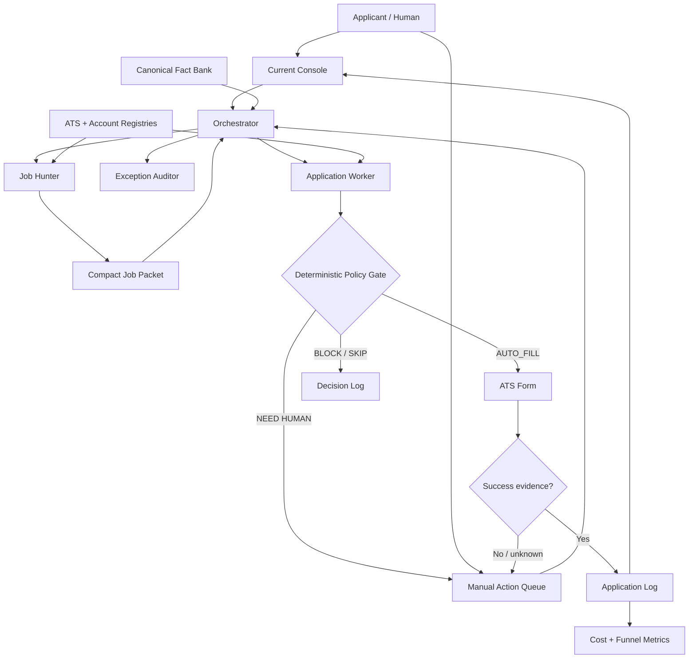

# AI Job Application Automation Blueprint 🤖📮

> A privacy-first, human-in-the-loop control plane for AI-assisted job applications.

[](#project-status)
[](#privacy-and-safety-boundaries)
[](LICENSE)

我一开始只是想少点几次 **Apply**，结果不小心造了一个小型 job-search control plane 😂

This repository turns the architecture behind my real AI-assisted job-application system into a reusable, sanitized blueprint. It is built around a less glamorous—but much more important—question than “Can AI write a cover letter?”

> Can an AI move quickly **without inventing facts, losing state, leaking private data, or pretending a PDF means an application was submitted?**

If you are building something similar, please tell me where this can be safer, simpler, or less expensive. I am nervous to share version one, but hiding it forever would be even less useful 😭🚀

## Project status

This is a **documentation-first reference architecture plus starter templates**, not a hosted service or a one-click auto-apply bot. You bring your own job sources, browser tooling, model providers, storage, and policy implementation.

The public repository contains **no real credentials, personal profile, employer history, application history, private answers, or confidential employer data**.

## The problem

AI can draft text quickly. A trustworthy application workflow has harder problems:

- Which resume facts are actually confirmed?
- Is this the official role, a duplicate, or a stale repost?
- Does a new ATS account already exist?
- Which fields may be filled automatically, and which require the applicant?
- Did the submission really succeed—or did we merely generate a file and click something?
- How much did the full funnel cost, including searches, skips, failures, and recovery?
- Can another model resume the work without rereading every transcript?

The design therefore treats job applications as a **stateful, policy-gated workflow**, not a text-generation demo.

## Design principles

1. **Facts beat fluent drafts.** Every career claim must come from an approved fact source.
2. **Understanding is not permission.** A model may classify a field; a deterministic policy gate decides whether automation may act.
3. **Fail closed on risky ambiguity.** Unknown legal, identity, compensation, authorization, or sensitive fields become `NEED HUMAN`.
4. **Evidence defines submission.** A success page or receipt is evidence; a generated PDF is not.
5. **Current state stays small.** The active console shows blockers and the next action; history lives elsewhere.
6. **Measure the honest denominator.** Human work never inflates the agent automation KPI.
7. **Keep going safely.** One blocked role should not freeze independent, eligible work.

## Architecture



The model proposes; the policy gate authorizes; the evidence closes the loop.

## End-to-end workflow

1. **Discover** roles from official sources and the ATS discovery registry.
2. **Canonicalize and deduplicate** using a stable job key such as `company + title + location + requisition ID or ATS URL`.
3. **Screen** for fit, hard blockers, authorization, location, and expected application friction.
4. **Create a compact job packet** instead of passing full browser logs and transcripts downstream.
5. **Route effort by value and risk.** Routine roles get a light path; high-upside or ambiguous roles get an exception audit.
6. **Tailor only from confirmed facts.** Never promote persuasive model output into a career fact.
7. **Classify each form field**, validate the structured result, and run it through the policy gate.
8. **Pause only the blocked role** when human action is required; checkpoint it and continue other safe work.
9. **Verify submission evidence** before marking `SUBMITTED`.
10. **Write back** the application log, cost ledger, registries, and current console.

Suggested lifecycle states:

```text
DISCOVERED → SCREENED → DRAFT → REVIEW_REQUIRED → READY
                                            ↘ BLOCKED
READY → SUBMITTED → CLOSED
```

`PDF_GENERATED` is a file state, not an application state. That distinction sounds tiny until it saves you from a fake success count 😅

For the detailed handoff contract and recovery rules, see [docs/WORKFLOW.md](docs/WORKFLOW.md).

## ATS and account registries

Two small registries prevent repeated discovery and duplicate account creation:

| Registry | Stores | Must never store |
|---|---|---|
| ATS discovery | Platform, official board identifier, last scan, guest-apply support, useful-role result, rescan rule | Scraped private applicant data, cookies, tokens |
| Account registry | Organization alias, ATS, login alias, account state, credential owner, non-secret note | Passwords, MFA seeds, verification codes, recovery codes |

Start with the sanitized examples in [`templates/`](templates/). Use aliases such as `PRIMARY_EMAIL` rather than a real address when the registry may be shared.

## `NEED HUMAN` and hard blockers

“Human in the loop” should be a precise queue, not a vague excuse.

| Situation | Default action |
|---|---|
| Password, email verification, MFA, CAPTCHA | `NEED HUMAN`; never store or bypass |
| Identity, e-signature, attestation | `NEED HUMAN` |
| Unknown required personal fact | `NEED HUMAN`; do not guess |
| New legal or work-authorization wording | `NEED HUMAN` unless an exact approved rule exists |
| Required numeric compensation with no approved value | `NEED HUMAN` |
| Assessment or interview | Human-only |
| Payment request | Block and review |
| Duplicate or uncertain prior submission | Stop until evidence is reconciled |
| Repeated tool failure or policy validation failure | Fail closed; checkpoint as `MANUAL_CHECK` |

A blocker record should contain only the minimum needed to resume: job key, step, exact field label/options, risk tier, reason, and checkpoint reference. It should not copy the applicant’s full profile.

## Cost per confirmed submission

Track two views of the same run:

```text
pipeline_cost_per_confirmed_submission
  = operating_run_cost / total_confirmed_submissions

agent_cost_per_confirmed_submission
  = agent_attributable_cost / agent_confirmed_submissions
```

- `total_confirmed_submissions` may include agent submissions and clearly labeled human-completed submissions.
- `agent_confirmed_submissions` includes only submissions completed and verified by the automation.
- If `agent_confirmed_submissions = 0`, the agent KPI is **`N/A`**, never zero.
- Discovery, skipped roles, failed pages, and recovery attempts still consumed operating cost.
- Keep one-time infrastructure experiments separate from recurring operating cost.

The long-term outcome KPI should move beyond volume toward **responses or interviews per unit of operating cost**. Cheap spam is still spam.

## Model routing

Use the cheapest layer that can safely finish the task:

```text
DETERMINISTIC CODE / LOOKUP
          ↓ unresolved
LOW-COST MODEL
          ↓ low confidence, conflict, or risk
STRONGER MODEL / EXCEPTION AUDITOR
          ↓ protected decision or missing fact
HUMAN
```

Good low-risk model tasks include extraction, tagging, normalization, schema-shaped summaries, and first-pass duplicate candidates. Models should not have final authority over protected fields, canonical personal facts, legal ambiguity, or submission truth.

Pass compact artifacts between workers:

- Hunter → Orchestrator: `JOB_PACKET`
- Auditor → Orchestrator: `AUDIT_DELTA`
- Browser worker → Policy gate: structured field classification
- Every worker → Logs: source references, decision, confidence, outcome

## Privacy and safety boundaries

Before connecting a browser or model provider:

- Keep the private fact bank outside this public repository.
- Store secrets only in a real secret manager or user-controlled credential system.
- Never commit resumes, cover letters, application receipts, browser profiles, cookies, exports, screenshots, or raw form captures.
- Do not infer protected characteristics or reuse a nearby-looking answer.
- Do not bypass CAPTCHA, MFA, anti-bot controls, or employer safeguards.
- Require explicit policy approval for irreversible actions.
- Log the outcome and evidence reference, not sensitive field values.
- Follow job-board terms, privacy law, and employer rules applicable to you.

See [SECURITY.md](SECURITY.md) before adapting this blueprint to live applicant data.

## Setup

1. Fork or clone this repository into a **private working environment**.
2. Copy the files in [`templates/`](templates/) and remove `.example` from your private copies.
3. Create one canonical, private fact source for approved resume claims and standard answers.
4. Define lifecycle states, duplicate keys, hard blockers, and evidence required for `SUBMITTED`.
5. Populate ATS and account registries with non-secret aliases only.
6. Implement a schema validator plus a fail-closed policy gate before any browser action.
7. Connect discovery and browser tooling in a sandbox or test form first.
8. Run a dry run with no final submissions.
9. Add cost checkpoints and verify that human submissions do not improve the agent KPI.
10. Enable live submission only after reviewing privacy, terms, rollback, and human handoff behavior.

## Repository map

```text
.
├── README.md
├── SECURITY.md
├── docs/
│   └── WORKFLOW.md
└── templates/
    ├── account_registry.example.csv
    ├── ats_discovery_registry.example.csv
    ├── job_packet.example.json
    ├── manual_action_queue.example.md
    └── run_cost_ledger.example.csv
```

## Roadmap

- [ ] JSON Schema validation for job packets and field decisions
- [ ] Policy-as-code reference implementation with fail-closed tests
- [ ] ATS adapters behind a common interface
- [ ] Deterministic duplicate detection and receipt verification hooks
- [ ] Local redaction scanner before any model or log write
- [ ] Evaluation set for hallucinated claims and unsafe form mappings
- [ ] Dashboard for funnel cost, response quality, and aged outcomes
- [ ] Export/import format for switching model providers without losing state

## Feedback welcome 💬

I would especially love feedback from recruiters, job seekers, privacy people, automation engineers, and anyone who has fought an ATS at 1 a.m. 😭

Open an issue with:

- a failure mode I missed;
- a safer human-handoff pattern;
- a better metric than raw application count;
- an ATS portability idea;
- or a place where the README sounds clever but would break in real life 😂

Please use fictional or redacted examples. Do not post personal applicant data in issues.

## License and disclaimer

MIT licensed. This project is an educational blueprint, not legal advice and not a guarantee of employment or ATS compatibility. You are responsible for how you connect it to live services and for every application submitted in your name.
